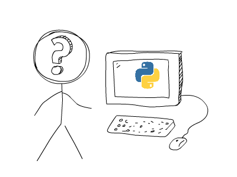

*一些有趣的鲜为人知的Python特性集合*

>无论你是Python新手还是Python老手，我相信，这个系列的文章都会让你获益良多！
>
> 本系列为我在github上的一个项目，由于markdown语法不同所以在简书上做了一些改动并且按章节来发。如果中间有什么错误，请务必留言我会第一时间改正。

---

Python作为一个设计优美的交互式脚本语言，提供了许多人性化的语法。但是也因为这个原因，有些Python的代码片段并不会按照用户想象的那样运行。

这一系列文章就让我们总结一下那些Python里反直觉的代码片段，并且深入研究一下其中的运行原理。

以后的某些例子可能并不像是标题说的那样....嗯....反直觉，但是它们依旧会带你揭示一些你从来没有意识到的Python语言特性。

而且，我发现这也是一种很好的学习编程语言的方法，不过前提是你不要认为这篇文章会告诉你一切，抛砖引玉而已。相信我，你需要的知识都隐藏在互联网的某个角落里。

如果你已经写了很久的Python代码，你可以把下面的这些例子当做一个挑战，试一试自己能不能在第一次就猜对结果。也许某些例子里的坑你已经遇到过并且解决了，那么再次看见这个坑的时候我想你会为当时自己的努力而自豪的。😄

好了，下面是整个系列的目录，每发布一篇那一篇的超链接就会变得可以点击。

- [▶ 善变的字符串] 
- [▶ 不变的哈希值] 
- [▶ 说了要执行就一定会执行！] 
- [▶ 鸠占鹊巢] 
- [▶ 神奇赋值法] 
- [▶ 时间的误会] 
- [▶ 特殊的数字们] 
- [▶ 三子棋之一步取胜法] 
- [▶ 没脑子的函数] 
- [▶ `is not ...` 并不是  `is`] 
- [▶ 尾部的逗号] 
- [▶ 最后一个反斜杠] 
- [▶ 纠结的not] 
- [▶ 只剩一半的三引号] 
- [▶ 消失的午夜零点] 
- [▶ 站错队的布尔型] 
- [▶ 类属性与类实例属性] 
- [▶ None的产生] 
- [▶ 不可修改的元组] 
- [▶ 消失的变量e] 
- [▶ 亦真还假] 
- [▶ 转瞬即空] 
- [▶ 子类的关系] 
- [▶ 神秘的键值转换 *] 
- [▶ 看你能不能猜到这个的结果？] 
- [▶ 无效的一行？] 
- [▶ 移形换位] 
- [▶ 到底哪里出错了呢？] 
- [▶ 不要在迭代一个字典的时候修改这个字典！] 
- [▶ 删不掉的对象] 
- [▶ 删除正在迭代中的列表项] 
- [▶ 被泄露出去的循环变量!] 
- [▶ 小心那些有默认值的可变参数!] 
- [▶ 抓住这些异常！] 
- [▶ 相同的操作，不同的结果] 
- [▶ 作用域之外的变量] 
- [▶ 小心那些链式操作符] 
- [▶ 被忽略的类变量] 
- [▶ 小心处理元组] 
- [▶ 人生苦短，我用Python ] 
- [▶ 为什么要用`goto`？] 
- [▶ 试试用大括号？] 
- [▶ 不等号的争议 ] 
- [▶ 就算Python也知道爱是个复杂的东西 ] 
- [▶ 这些语句是存在的！] 
- [▶ 无限  ] 
- [▶ 被修改的类成员 ] 
- [▶ `+=`更快] 
- [▶ 超长字符串!] 
- [▶ 字符串到浮点数的转换] 
- [▶ 最后一些小特点集合] 


# 示例结构说明

下面是每个例子里通用的结构说明：

> ### ▶ 这里是例子的标题 *
> 首先是例子的标题。
> ```py
> # 第一个代码段里面会有一些初始化代码
> # 为后续的输出代码段做准备...
> ```
>
> **Output (Python version):**
> ```py
> >>> python语句，执行某个命令
> 一些输出（可能你想得到，也可能想不到）
> ```
> (可选): 有可能会说明一下上面输出的内容
>
>
> #### 💡 解释:
>
> * 简短的介绍发生了什么和为什么会产生这些输出。
>   ```py
>   一些初始化代码
>   ```
>   **Output:**
>   ```py
>   >>> 执行代码 # 这些代码会展示为何会有上方那些输出内容
>   ```

**注意：** 所有的代码都是在 Python 3.5.2 环境下测试通过，理论上如果没有特殊声明，可以在所有的Python版本下运行。

# 使用方法

在我看来，为了充分的利用这个仓库里的所有例子，最好的办法就是按照顺序把每个例子挨个看一遍：
- 仔细阅读每个例子的初始化代码。如果你是一个经验丰富的Python程序员，那么大部分时候你都可以知道初始化代码执行后具体会发生什么。
- 阅读输出结果并且，
    + 检查输出结果是否和你想的一样
    + 确认你是否知道产生这种结果背后的原理，
        - 如果不知道，那么请仔细阅读解释章节（如果看完解释还是不懂的话，那就在下面评论吧）
        - 如果知道，那么给就自己点个赞，继续看下一个例子


# 一些说明

- 这个系列翻译自 [What the fu*k Python](https://github.com/satwikkansal/wtfpython)
- 如果你有任何好的想法和意见，请务必要分享给我
- 我会在收集并修正一些bug后生成pdf版本的Crazy Python，想要的小伙伴可以[发信](mailto:shi12li12@gmail.com)给我，或者关注公众号**编程行动派**，我也会第一时间在公众号里通知大家
- 转载注明出处

